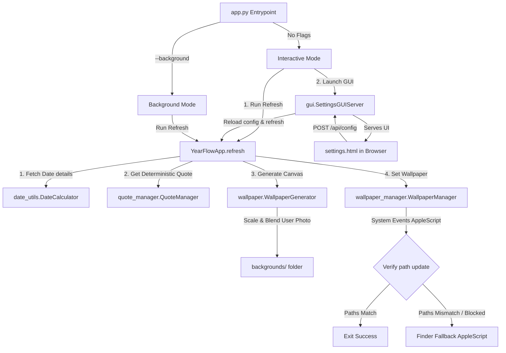

# YearFlow • Technical Architecture & Developer Guide

This document provides a comprehensive technical overview of the **YearFlow** codebase. It is designed to help senior developers quickly understand the architecture, data flow, custom rendering logic, macOS sandboxing workarounds, local GUI server, and packaging configuration.

---

## 1. Architectural Overview

YearFlow is a minimalist macOS utility that generates a typography-based progress wallpaper daily and sets it as the system desktop background. It operates in two modes:

1. **Interactive Mode (Default)**: Launches a lightweight local HTTP server, opens a settings dashboard in the user's default browser for real-time customization (colors, fonts, layout toggles, backgrounds), immediately refreshes the desktop on save, and shuts down on request.
2. **Background Mode (`--background`)**: Initiates a fast, silent, head-less wallpaper refresh. This is executed by the macOS `launchd` scheduler.



---

## 2. Directory & Module Structure

```
YearFlow/
├── app.py                  # Entrypoint, orchestrator, CLI arguments parser
├── config.py               # Settings schema, JSON parser, dynamic system font resolver
├── config.json             # Active user settings (colors, fonts, opacity, widget flags)
├── gui.py                  # Zero-dependency HTTP settings API server
├── settings.html           # Settings dashboard HTML, CSS, and JS template
├── wallpaper.py            # Pillow canvas drawing, layout cards, background photo fit & blend
├── wallpaper_manager.py    # AppleScript macOS wallpaper runner and verification check
├── date_utils.py           # Calendar progress, leap year math, date snapshot builder
├── quote_manager.py        # Modulo-based daily quote selector
├── scheduler.py            # LaunchAgent .plist generator, installer and uninstaller
├── fonts/                  # Bundled Inter TTF font files
├── backgrounds/            # Default directory for user background images
├── launchd/                # LaunchAgent template files
├── generated/              # Output directory for wallpapers in dev mode
├── dist/                   # Bundled app (YearFlow.app) and disk image (YearFlow.dmg)
└── build_dmg.sh            # PyInstaller compilation and DMG packaging script
```

---

## 3. Core Component Deep-Dive

### A. Dynamic Custom Backgrounds (`wallpaper.py`)
Instead of a simple solid color canvas, the generator can load user-provided photos:
- **Scan**: Iterates through the backgrounds directory for valid image files (`.png`, `.jpg`, `.jpeg`, `.webp`, `.bmp`).
- **Deterministic Selection**: To prevent the wallpaper from changing multiple times on the same day (and preserve the "daily card" concept), the image is chosen using the date's ordinal number:
  ```python
  day_index = date_val.toordinal()
  selected_file = image_files[day_index % len(image_files)]
  ```
- **Cover Scale & Fit**: Images of arbitrary sizes are cropped and scaled to fit the display's exact resolution (retaining center alignment) using Pillow's `ImageOps.fit()` method:
  ```python
  cover_img = ImageOps.fit(img, (canvas_width, canvas_height), centering=(0.5, 0.5))
  ```
- **Legibility Blending**: To ensure the high-contrast typography and cards remain readable over bright images, the cover image is blended with the configuration's solid `background_color` using `Image.blend()` at a customizable opacity (default `0.15`):
  ```python
  blended = Image.blend(solid_bg, cover_img, opacity)
  ```

### B. Dynamic Font Resolver (`config.py`)
To populate a font selection dropdown without heavy native font dependencies:
- Scans system directories (`/System/Library/Fonts`, `/Library/Fonts`, and `~/Library/Fonts`).
- Uses Pillow's `ImageFont.truetype(file).getname()` to extract the true font family name (e.g. `"Helvetica Neue"`) and style name (e.g. `"Bold"`).
- Groups font files by family name into a mapping dictionary:
  ```python
  { "Menlo": { "Regular": "/path/to/Menlo.ttc" }, ... }
  ```
- When `font_family` is saved, the resolver matches the closest styles for `Regular` (default/roman/plain), `Medium` (semibold/500/600), and `Bold` (700/800) weights, and maps them to Pillow font inputs.

### C. Lightweight Settings GUI Server (`gui.py` & `settings.html`)
The settings interface is served by a standard-library `HTTPServer` running on a background thread:
- **Endpoints**:
  - `GET /`: Serves the dark-mode HTML dashboard.
  - `GET /api/config`: Returns active configs.
  - `GET /api/fonts`: Returns the sorted list of scanned font family names.
  - `POST /api/config`: Writes updated settings to `config.json`, reloads `config.CONFIG`, and executes `app.refresh(force=True)`.
  - `POST /api/close`: Stops the HTTP loop via `server.shutdown()`, terminating the app.
- **TCC Permission Workaround**: Because saving settings edits the same files, standard-level caching in macOS can refuse to redraw. The server forces refreshes with `force=True` which bypasses the duplicate checks.

### D. Robust macOS Wallpaper Manager (`wallpaper_manager.py`)
Setting wallpapers programmatically on modern macOS (Sonoma/Sequoia) is highly sandboxed:
- **Redundant Check**: Compares active wallpaper paths to avoid double-triggers. Bypassed when `force=True`.
- **System Events AppleScript**: Attempts to iterate over physical displays:
  ```applescript
  tell application "System Events" to repeat with currentDesktop in desktops to set picture of currentDesktop to "..."
  ```
- **Verification step**: Queries macOS path immediately after. If System Events fails silently (reporting success but not changing the settings due to virtual desktop/Spaces sandbox limitations), it triggers the **Finder Fallback AppleScript**:
  ```applescript
  tell application "Finder" to set desktop picture to POSIX file "..."
  ```
- **Automation warning**: Logs an explicit warning details popup if the path still doesn't match, prompting the user to grant Terminal/YearFlow "Automation" permissions.

---

## 4. Packaging & Distribution (`build_dmg.sh`)

Packaging is handled via PyInstaller. Key arguments in `build_dmg.sh`:
- `--windowed`: Creates a standard GUI `.app` bundle (`dist/YearFlow.app`) rather than a console executable.
- `--add-data`: Bundles `quotes.json`, `fonts/` directory, `launchd/` plist template, and the custom `settings.html` directly into the app package (`sys._MEIPASS` when frozen).
- **DMG Creation**: Creates a staging folder, creates a symlink to `/Applications`, and formats the disk image:
  ```bash
  hdiutil create -volname "YearFlow" -srcfolder "dist/dmg_build" -ov -format UDZO "dist/YearFlow.dmg"
  ```

---

## 5. Critical macOS Quirks & Troubleshooting

Senior developers maintaining this tool should be aware of the following system behaviors:

### 1. Preset Wallpaper Mode Block
If macOS is currently set to a default Apple dynamic wallpaper, dynamic color, or preset panorama, **macOS will block AppleScript from modifying the wallpaper**.
- **Fix**: The user must go to **System Settings > Wallpaper**, click **Add Photo**, and select any custom picture once. This switches macOS into "Custom Image" mode, which opens the API permissions.

### 2. TCC Automation Permissions
When run inside the App bundle, the app needs permission to control System Events and Finder.
- If it fails to change, check **System Settings > Privacy & Security > Automation** and verify that `YearFlow` (and Terminal) have permissions checked for `Finder` and `System Events`.
